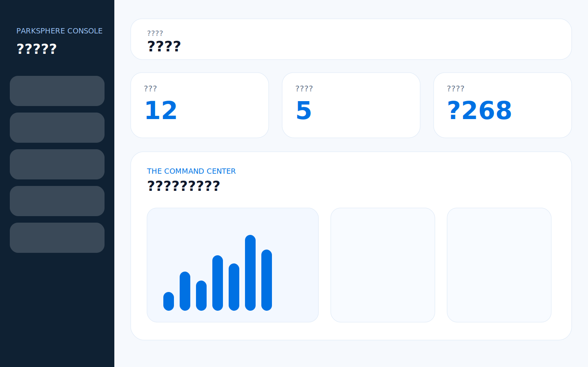
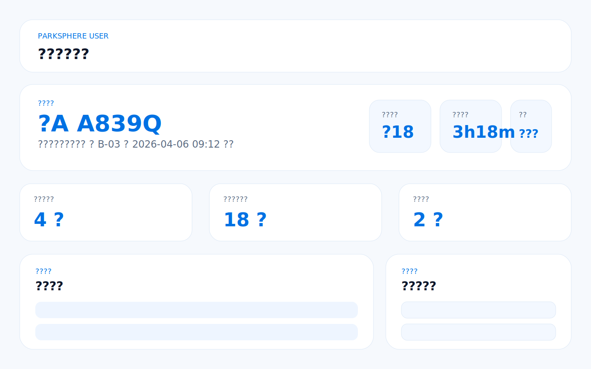

# Parking Management System

A role-based parking management platform built with Vue 3 and Express for parking operators, merchants, and car owners. The project includes an authentication portal, an operator command center, entry and exit control, billing configuration, parking-space operations, a financial overview, and a user-facing service portal.

## Screenshots

### Login Portal


### Admin Command Center


### User Service Portal


## Highlights

- Role-based experience for administrators, merchants, and end users
- Password login and SMS-code quick login with slider verification simulation
- Registration workflow with merchant/admin review submission flow
- OCR-based plate recognition simulation with whitelist and blacklist handling
- Parking-space operations for reserve, occupy, release, and monthly assignment
- Flexible billing configuration with free minutes, hourly rate, step rate, and fee cap
- Financial dashboard with daily revenue, discount tracking, and trend modules
- User portal with active parking details, reservations, coupons, billing history, and membership status

## Tech Stack

- Frontend: Vue 3, Vite
- Backend: Express 5
- Authentication: JWT, bcryptjs
- Data store: local JSON seed data for demo and development

## Project Structure

```
parking-management-system/
?? src/
?  ?? App.vue
?  ?? api.js
?  ?? assets/
?? server/
?  ?? data/db.json
?  ?? lib/
?  ?? index.js
?? docs/images/
?? package.json
?? README.md
```

## Getting Started

### Prerequisites

- Node.js 20+
- npm 10+

### Install Dependencies

```bash
npm install
```

### Start the Backend API

```bash
node server/index.js
```

The API runs by default at [http://localhost:5050](http://localhost:5050).

### Start the Frontend

```bash
npm run dev
```

The Vite development server runs by default at [http://localhost:5173](http://localhost:5173).

## Demo Accounts

| Role | Account | Password |
| --- | --- | --- |
| Admin | `admin@parksphere.local` | `Admin@123` |
| Merchant | `merchant@parksphere.local` | `Merchant@123` |
| User | `user@parksphere.local` | `User@123` |

SMS quick login test numbers:

- `13800138000` ? `246810`
- `13900139000` ? `135790`
- `13700137000` ? `864209`

## Core Modules

### Authentication and Security Portal

- Password login and SMS-code quick login
- Remember-me option and slider verification simulation
- Registration workflow for merchant and admin roles

### Command Center

- Parking-space overview and occupancy snapshot
- Device alerts and notification center
- Revenue and utilization summary cards

### Entry and Exit Control

- OCR recognition simulation with manual correction support
- Whitelist auto-pass and blacklist interception flow
- Entry creation and exit settlement APIs

### Billing Engine

- Free minutes, hourly billing, step billing, and capped amount configuration
- Coupon deduction during checkout
- QR-style payment presentation for operator workflow demos

### Space Operations

- Interactive parking-space map
- Support for reserve, occupy, release, and monthly-space conversion
- Available to both admin and merchant dashboards

### User Service Portal

- Active parking session details
- Upcoming reservations and service notices
- Coupon wallet and recent order history
- Monthly membership status and renewal entry points

## API Overview

| Method | Endpoint | Description |
| --- | --- | --- |
| POST | `/api/auth/login` | Login with password or OTP |
| POST | `/api/auth/send-otp` | Request demo OTP |
| POST | `/api/auth/register` | Submit merchant/admin registration |
| GET | `/api/dashboard` | Load role-based dashboard payload |
| POST | `/api/ocr/recognize` | Simulate OCR plate recognition |
| POST | `/api/entries` | Create a parking entry record |
| POST | `/api/exits` | Create an exit settlement |
| PUT | `/api/billing/config` | Update billing rules |
| PUT | `/api/spaces/:code` | Update parking-space state |

## Notes for Production Use

This repository ships with local seed data for demo and development. For a production deployment, replace the JSON data store with a database, move secrets to environment variables, and integrate a real OCR provider, payment service, and device gateway.

## License

This project is licensed under the MIT License. See [LICENSE](./LICENSE) for details.
